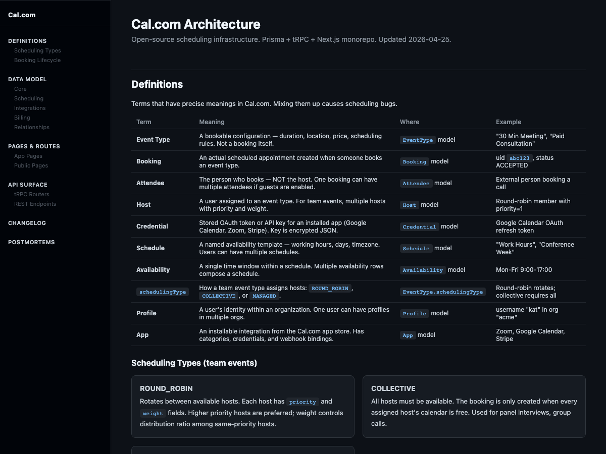
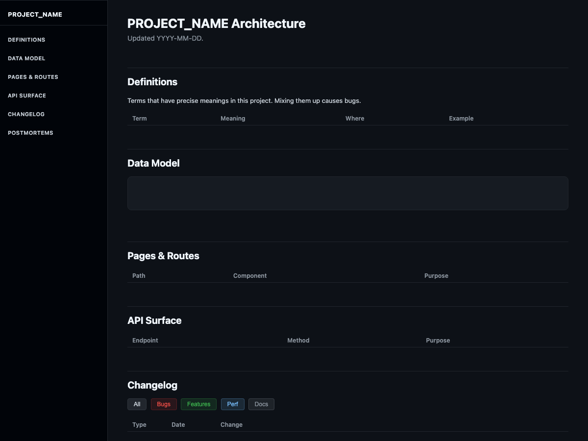

# human-docs

A single HTML file that documents your product's architecture. Both humans and AI agents can read it. No build step, no renderer, no framework — open it in a browser.



*Cal.com example — definitions, ERD, API surface, changelog, postmortems in one file.*

## Origin

I kept asking AI agents to generate HTML artifacts — ERD visualizations, kanban boards, postmortems, changelog tables. Each time I'd look at the output in a browser, get what I needed, and throw the file away.

Then I stopped throwing it away.

The HTML was already structured. The tables already had the data. The section headers already organized the architecture. Why regenerate from scratch when I could just update the sections that changed?

And it turns out HTML is the natural dual-audience format. Humans need rendered visuals — HTML gives that in any browser, no build step. Agents need parseable structure — section markers, semantic tables, and entity cards are easy to read and update programmatically. Markdown needs a renderer (GitHub, VS Code, Obsidian) before a human can see the visual hierarchy. HTML is its own renderer.

So the template is: stop generating disposable artifacts. Start maintaining a single file that compounds.

## Why

- **One file.** No scattered pages, no broken links, no "where did we put that?"
- **HTML, not markdown.** Styled, navigable, with a sidebar. Opens in any browser. Looks good without a renderer. Agents parse the structure directly.
- **PM-minded sections.** Definitions (what does "customer" mean here?), postmortems (what broke and why), changelog (what shipped). Not just endpoint lists.
- **AI-generated, human-curated.** Point an AI at your codebase and this template. It fills in the sections. You decide what stays.
- **Delta updates.** `<!-- SECTION:name -->` markers let agents update one section without regenerating everything.
- **Both audiences, one artifact.** Humans read the rendered page. Agents read the HTML source. No format conversion, no sync problem.

## What's in the box

```
template.html   The empty scaffold. Fork this, fill it in.
PROMPT.md       Prompt for any AI tool to generate/update the doc.
example.html    Cal.com's architecture — a filled-in example so you can see what "done" looks like.
```



*The empty template — dark sidebar, section placeholders, ready to fill.*

## Usage

### First time

1. Copy `template.html` into your project (e.g., `docs/architecture.html`)
2. Open your AI tool (Claude Code, Cursor, Codex, etc.)
3. Paste the contents of `PROMPT.md` as your prompt
4. Point it at your codebase
5. Open the generated file in a browser

### Updating

Tell your AI tool which sections changed:

> "Update the changelog and postmortems sections. Here's what changed: [paste diff or describe]"

The AI uses `<!-- SECTION:name -->` markers to edit only the affected sections. The rest stays untouched.

### Adding sections

The template ships with core sections. PROMPT.md includes optional sections you can add:

- **User Stories** — acceptance criteria tables
- **Customer Model** — for multi-tenant products
- **Board** — kanban for small teams
- **Emails** — transactional email catalog

## Sections

| Section | What it answers | Why it matters |
|---------|----------------|----------------|
| Definitions | "What does X mean in this codebase?" | Prevents the #1 source of bugs: overloaded terms |
| Data Model | "What tables exist and how do they relate?" | ERD + entity cards, grouped by domain |
| Pages & Routes | "What can users see?" | Every frontend route with its purpose |
| API Surface | "What can code call?" | Endpoints grouped by domain |
| Changelog | "What shipped?" | Filterable by type (bug, feature, perf, docs) |
| Postmortems | "What broke and how do we prevent it?" | Root cause, impact, fix, prevention rule |

## Philosophy

**Docs should be readable without context.** If you hand this file to someone who just joined your team, they should understand what the product does, what the data looks like, what broke recently, and what shipped.

**Postmortems are the most valuable section.** Changelogs tell you what happened. Postmortems tell you what to never do again.

**One file is a feature, not a limitation.** The moment you split docs across files, someone stops updating one of them. A single file means one place to look, one thing to update, one artifact to share.

**AI generates, humans curate.** The AI reads your codebase and fills in the template. You read the output and fix what it got wrong. Over time the doc compounds: each update adds to the changelog, each bug adds a postmortem.

## License

MIT
